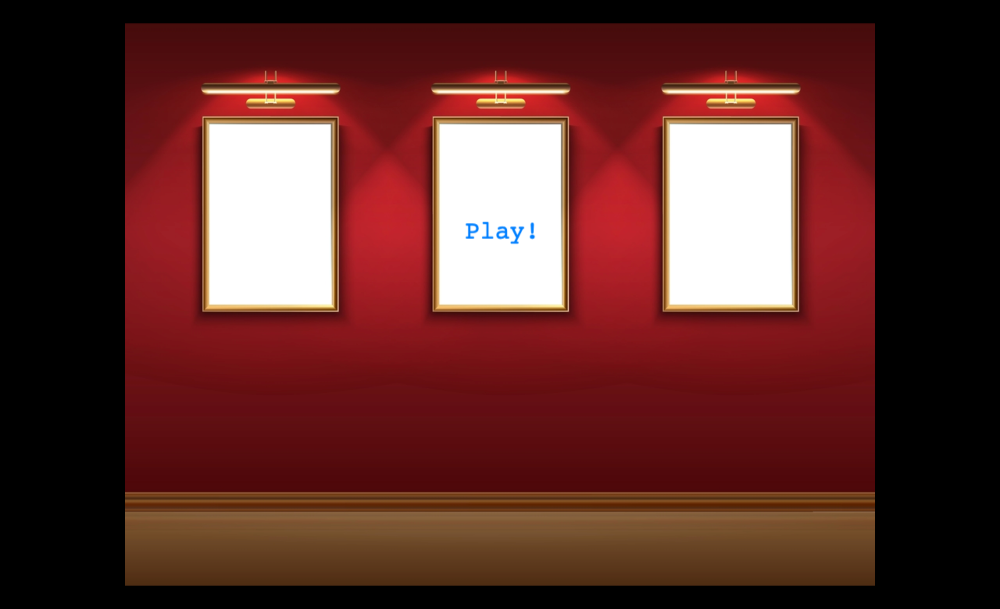

# "Artopia Donation Game Demo"

A prototype Phaser application that demonstrates the working pipeline for the Artopia Donation Game.

## Getting Started

### Running the Project

n VS Code click the Terminal dropdown in the menu bar and click "New Terminal". A window should open in the lower half of your screen.

In the terminal window type:

`npm install`

This will install the libraries our project uses.

Next type:

`npm run start`

You should see a message saying `Server running at http://localhost:1234`. If so, go to [http://localhost:1234](localhost:1234) in your web browser.

If everything worked as intended we should see a game load in our browser like so:

## A Few More Notes

This project is set up to use a library called [Parcel](https://parceljs.org/). If you would like to know what Parcel does you can [watch this video](https://www.youtube.com/watch?v=5IG4UmULyoA). Just be aware this is a semi-complicated topic and you do not need to understand how Parcel works for this project.

