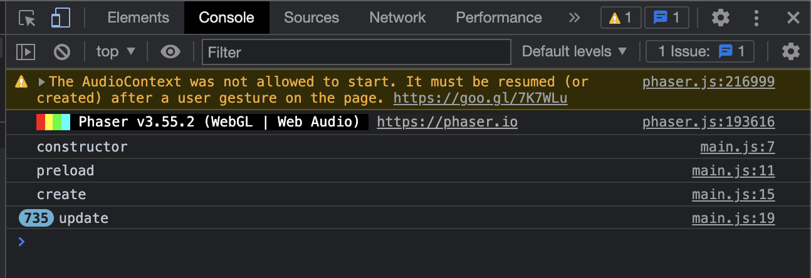
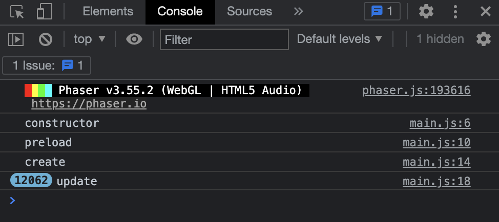

# Audio Warning
In our console above the `console.log` messages we see a warning the reads `The AudioContext was not allowed to start. It must be resumed (or created) after a user gesture on the page.` This message refers to the autoplay features provided by chrome for audio settings. Usually in most browsers when a web page is loaded all audio sources are either muted or stopped from playing until the user interacts with an element of that page to trigger the audio. [You can find more information about chrome's autoplay policy here.](https://developer.chrome.com/blog/autoplay/)

---

Navigating back to our web browser you should still see something like this:



## How and Why do we get rid of the warning? 

### Why?
First let's make clear that this warning is not affecting the code in any of our files, we could leave it in there and things would compile and run fine from the start of this tutorial to the end. For example, if you take a look at the console all of the `console.log` messages should still be appearing perfectly fine. However, the warning message is a little distracting and makes the console look a bit cluttered. It's nice to have a clean workspace so it makes sense that we would want to get rid of the warning message to make deugging and testing easier later in the tutorial.

### How?

To get rid of the warning open the `main.js` file and navigate to line 38:

```js
scene: GameScene,
```
Below this line add the following 3 lines of code:
```js
    audio: {
        disableWebAudio: true,
    },
```

Make sure to save then navigate back to the console on the web browser. You should now see:



## Review

```js
disableWebAudio: true,
```

This line of code disables the use of all web audio and uses HTML5 audio instead. This serves as a nice work-around for our audio input which we will cover in another section of the tutorial.

# Next Step
Now there should be no errors/warnings in the console. If so we can move onto the [next step](step05.md)!