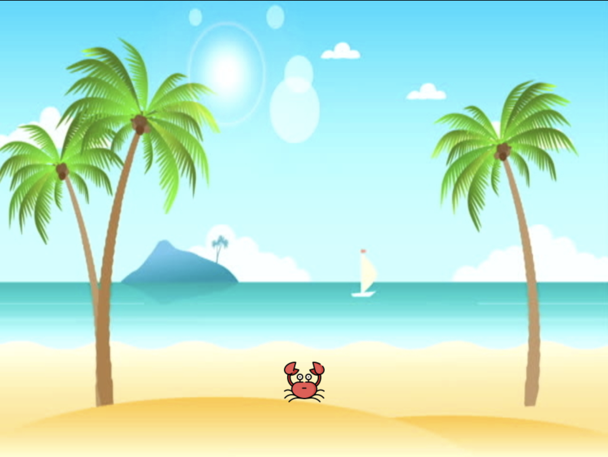

# World Building

## Display an Image
Let's build up our scene by first adding our background image. We will be adding this to the `create()` function.

> This function is relatively straightforward - it runs once at the beginning of the game and allows the user to place the things that they’ve preloaded with preload() and create objects within our game such as animations, collision detectors, text, groups, and much more.

Inside `main.js` navigate to the `create()` function on line 19:

```js
create() {
    console.log("create");
}
```

Below the `console.log()` command add:

```js
// Add images to Scene
this.add.image(480, 360, 'background');
```

> This line simply places the image on coordinate `(480, 360)`. Try it out, and see if your background is no longer a black screen!

## Placing a Character

Next, let's add our player character to the screen. To do this, we must first define a variable that will reference our player object. Navigate to the top of `main.js` inside the `constructor()` and add the following code below the `console.log()` on line 6:

```js
// Misc game object declarations
this.player;
```

Back inside `create()` below the line where we added the background add the following:

```js
this.player = this.physics.add.sprite(480, 600, 'player');
```

Save the file then load [localhost:1234](http://localhost:1234), we should see our background image displayed as well as our player character at the bottom center of the screen like so:



# Review

> The coordinate `(480, 360)` refers to the location where we are placing the center pixel of our image. This means that `(480, 360)` will be the center of the game. We are placing the image here so that it covers the whole screen as a background should.

For reference, coordinate `(0,0)` is located in the top left corner, and `(960, 720)` is located in the bottom right corner of our scene. This is why when we place our background image with the same dimension it fits perfectly into the scene.

The purpose of the variable `this.player` is to serve as a reference to our player object which we will need to access later in our code when we're adding movement and other mechanics. The background image does not need to be referenced by a variable because we only interact with it once when we place it inside the scene.

# Next Step
Now that the images have been successfully added to the scene, we can begin adding some mechanics in the [next step](step8.md)!