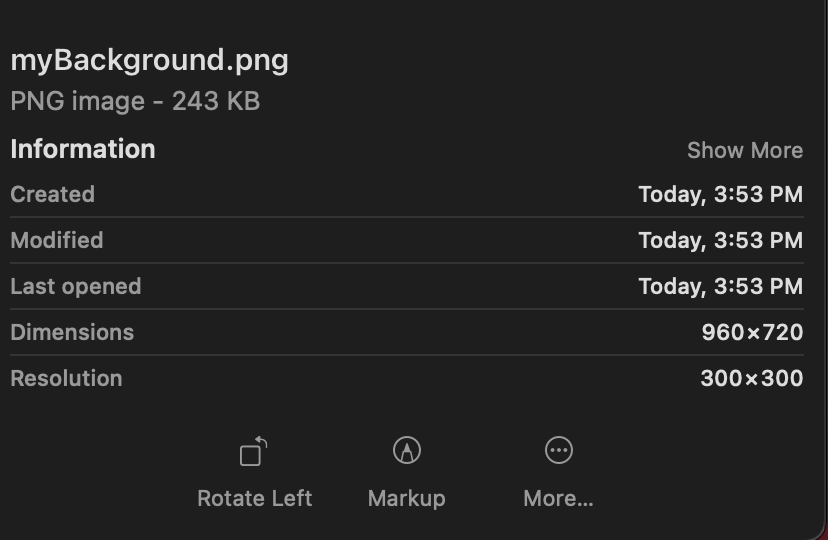
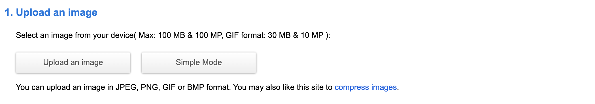
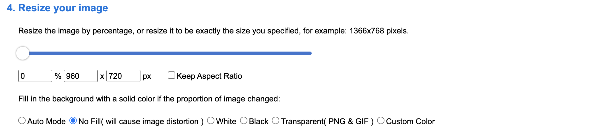
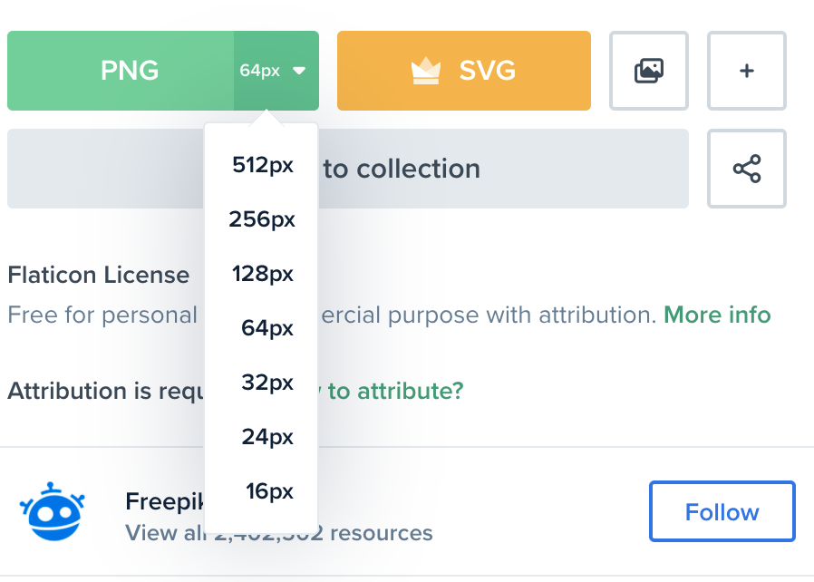

# Building our first Scene in Phaser

A scene is a game state that the user is operating within, this essentially means that everything the player will see within the game will at some point appear in this space. To keep things simple, in this tutorial we will be using one scene for our entire game. More information on scenes can be found [here](https://workshops.nuevofoundation.org/phaser-space-invaders-game/phaser-fundementals/).

## Select a Theme

Before we start adding things into the scene we need to pick a theme for our invaders game. The traditional game has a space theme, hence the name 'space invaders'. The `final.js` file used as an example for this tutorial has the code for an 'afh' themed invaders game. But now that we're creating a new invaders game it's up to you to decide what theme you want to go with.

### Background

Let's make this a bit easier by starting with a background for our game to take place. Visualize the world or environment the players and enemies will be moving within, then use google images to find a nice visual representation that captures that feeling. Use the [freepik website](https://www.freepik.com/) to browse through different background options if you can't think of any.

Let's create a folder that will hold all our assets for the game like this background image. In vscode inside of the tutorial folder create a new folder and name it `gameAssets`. Now download your selected background image and save it inside this folder as `myBackground.png`. 

Before we move on to the next image for our game we have to make sure the background is the proper size so that when we display it in the scene we don't have any issues. On a mac, you can check the attributes of the image in the finder window by navigating to that file selecting it but don't open it. Take a look at the dimensions attribute and make sure it is set to `960 x 720` like so: 

If the dimensions of the image are different they can be changed using this [website](https://resizeimage.net/#google_vignette). First, upload the downloaded image as outlined in step 1:

Then skip to step 4 where you will uncheck the `keep aspect ratio` box and set the pixel size to `960 x 720 px` like so:

Finally, in step 6 set the output image format to `png` and hit the resize image button. Once complete download the newly resized image, check the attributes for the correct dimensions, then save it in the `gameAssets` folder again as `myBackground.png`. This version should replace any previous version within the `gameAssets` folder.

Now that we've saved our first game image, selecting and setting up our remaining images should be straightforward.

### The Player
Let's choose an image for our player character next. This image will represent the character that the user will be controlling as they play our game. Make sure the selected player is related to the background in some way to make the game immersive and keep the theme consistent.

You can use google images for this step as well but I would recommend using the [flaticon website](https://www.flaticon.com/) for free high-resolution images. Find an image using the search bar to navigate through the different pages of the site until you find something you like, there are many useful filters.  

Another useful feature of the flaticon site is when downloading the image you can also preselect the pixel size which saves some time. We want our player image to be `64 x 64` so when downloading make sure to preselect that as our `png` image size like so:

Once you have the image downloaded save it in the `gameAssets` folder as `myPlayer.png`

### The Enemy
We're going to need an enemy for the player to interact with so let's choose one next. Again make sure the image you select relates to the theme you originally selected for our game. This must also be a `64 x 64` image so we'll use the flaticon site again. Once you've found an image you like, download and save it in `gameAssets` as `myEnemy.png`.

### The Projectile
The final image we will need for our game is an image that represents the projectile that our player is using firing at the enemy. Don't get too tied up on making the projectile fit the theme, if you can that would be ideal but if you want to use lasers that is also fine. Use the flaticon site for this image as well, this time, however, set the pixel size to `32 x 32` save the image as `myProjectile.png` in `gameAssets`.

# Next Step

Now that we have all our image files where we want them we can start loading them into our scene in the [next step](step6.md)!