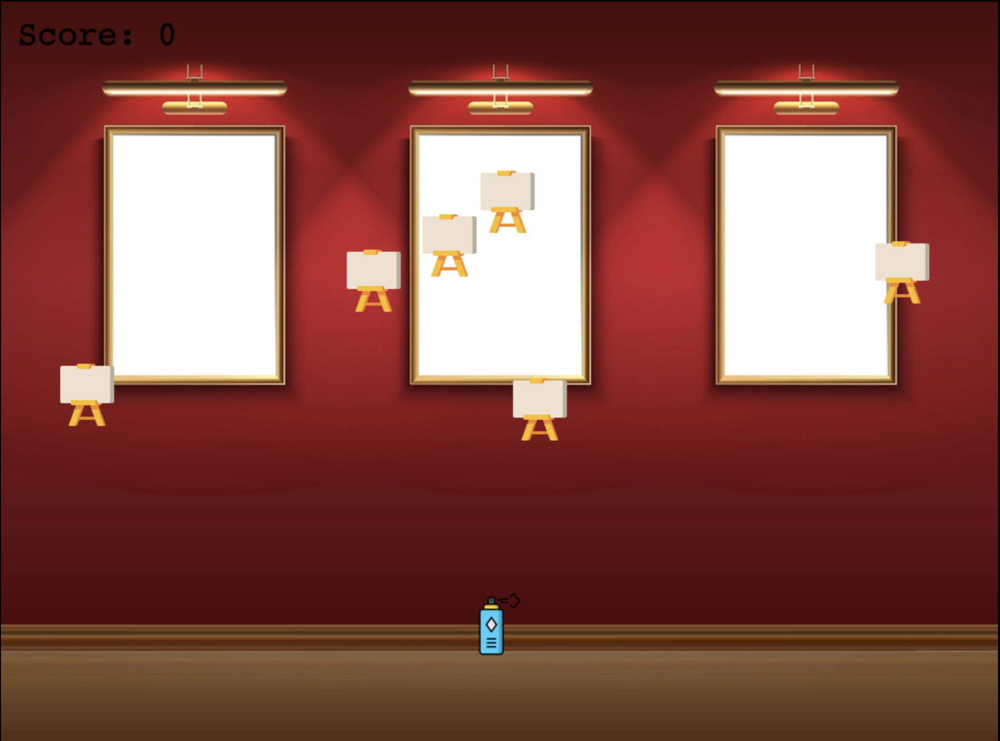

# Introduction to Phaser Game Development

## Overview

Welcome to this exciting journey where you will learn to create a captivating game using Phaser 3, a popular and powerful framework for building browser games. Our project will be a simple yet engaging game where players control a spray can, aiming to paint as many canvases as possible while avoiding obstacles and enemies that come their way. The game will feature a vibrant background, a player-controlled spray can, moving enemies, and a score system to track your progress. Throughout the game, players will experience various challenges that increase in difficulty, making it an enjoyable experience for both beginners and seasoned gamers.

## Learning Outcomes

By following this tutorial, you will gain hands-on experience with several core concepts of game development with Phaser, including:

- **Setting Up a Phaser Project:** Learn how to create a new Phaser game, including setting up your development environment and understanding the structure of a Phaser project.
- **Loading and Displaying Assets:** Discover how to load various types of assets such as images and audio into your game and display them on the screen.
- **Handling Input:** Implement keyboard controls to move the player sprite (spray can) across the game world.
- **Physics and Collisions:** Dive into Phaser's physics system to add realistic movement to your game objects and detect collisions between them.
- **Creating Enemies:** Learn how to generate multiple enemies dynamically, manage their behavior, and implement logic for player-enemy interactions.
- **Scoring System:** Design a scoring system that updates the player's score based on game events, such as hitting targets.
- **Audio:** Enhance your game's atmosphere by adding background music and sound effects for various game actions.
- **Game Over and Restart Mechanics:** Implement a game over scenario and allow players to restart the game and try again.

By the end of this tutorial, you'll have a solid foundation in game development with Phaser 3 and the skills to create your own browser-based games.

Let's get started on this exciting journey into the world of game development!

 

### [Next: Scene Structure](./1-setup.md)

