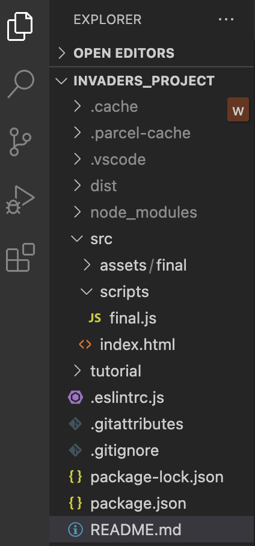

# Before we begin

As we mentioned in the [README](../../README.md) all of the files we use and code we write will be inside of the `src` folder. For simplicity, we will not put `src` whenever we are referencing files. So, when I say open `scripts/final.js` I am referring to the file in `src/scripts/final.js`.

## Extra Information: Paths and Referencing Files

> *NOTE: This section is optional to read about if you are interested in how files in our branch are connected.*

When referencing these files, we use something called a *path* to find a file located somewhere in our tree of folders. In computers, files are located inside of folders, which can be located inside of folders, all the way up to the root directory.

Think of each directory as a branch, with smaller branches inside of it. You can also think of each file in the folders as leaves on the ends of these branches. In our case, the `src` directory is a tree while the folders (or *subdirectories*) `assets` and `scripts` are branches. Extending this metaphor, the file `index.html` is a leaf of the `src` branch. Instead of a conventional tree branching upwards, though, the tree of a computer's folders go downwards. When we get closer to the root (or the tree trunk of folders, the master folder), we are moving **up** the tree. The farther we get from the master folder, the further **down** we move on the tree.

When we want to reference a file in the same directory as the one we are using to make the reference, we use `./`. For files not in our current directory, we can jump to folders outside of our current one using `../`.

Take this example file tree:

```
space-invaders/
├─ dist/
├─ node_modules/
├─ src/
│  ├─ assets/
│  │  ├─ image.png
│  ├─ scripts/
│  │  ├─ final.js
│  ├─ index.html
├─ tutorial/
├─ package.json
```

This is similar to what your workspace will look like after installing dependencies and running your game. If we are inside of `final.js` and want to add `image.png` to our game, inside of final.js we would say `../assets/image.png`. 

## Overview of the Existing Files

Before we go and write our own code we will review the existing files already there as shown below:



### [index.html](../../src/index.html)

This is the HTML file for our game. When you go to [localhost:1234](http://localhost:1234) in your browser this is the file it is loading.

From here on we will focus on Javascript.

### [scripts/final.js](../src/scripts/final.js)

This is the complete Javascript file for our game. Currently when we load [localhost:1234](http://localhost:1234) it is running this code. As I mentioned above, our [index.html](../../src/index.html) is what gets loaded in the browser. If you open [index.html](../../src/index.html) and [go to line 27](../../src/index.html#L27) you should see:

```html
<script type="module" src="./scripts/final.js"></script>
```

Notice the `./scripts/final.js`. This is how our HTML file loads our Javascript file. 

### [assets](../../src/assets)

This folder contains all of the "assets" our project will use. An asset can be an image file, audio file, or video file. In this project, we will just be using image and audio files.

# Next Step

You are ready to move on to the [next step](step02.md)!