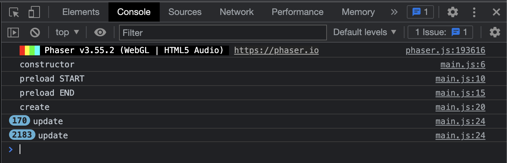

# Loading game assets
Before we can display or attach any movement mechanics to our images we must first load them into the scene. This will take place inside of our `preload()` method, you can read more about this method as well as the `create()` and `update()` methods [here](https://workshops.nuevofoundation.org/phaser-space-invaders-game/preload-create-update/).

Inside `main.js` navigate to the `preload()` method on line 9:

```js
preload() {
    console.log("preload");
}
```

and add the following code inside the curly brackets underneath the `console.log()` command:

```js
this.load.image('background', new URL('../assets/myAssets/myBackground.png', import.meta.url).href);
this.load.image('projectile', new URL('../assets/myAssets/gameAssets/myProjectile.png', import.meta.url).href);
this.load.image('enemy', new URL('../assets/myAssets/gameAssets/myEnemy.png', import.meta.url).href);
this.load.image('player', new URL('../assets/myAssets/gameAssets/myPlayer.png', import.meta.url).href);
```

## Review

```js
this.load.image('player', new URL('../assets/myAssets/myPlayer.png', import.meta.url).href);
```

The images have been loaded into the scene, so why do we still see a black screen when we load [localhost:1234](http://localhost:1234)? This is because we have yet to tell our program to do anything with our newly loaded images. The `game.load.image()` method has two input parameters, the first is a unique string that represents an `imageKey` that we'll use to identify the image later in our code and the second is a URL that links to where the image is saved in the file directory. The `/assets/myAssets` section is telling the program which folders to look inside of to find our image `myPlayer.png`.

Even though we have nothing on the screen yet it is common practice to test our code to see if our program is running smoothly especially after adding new lines of code. In most cases, we want to check for any errors or warnings that stop the code from executing. In this case, we want to check if the images are being loaded successfully.

Inside `main.js` navigate to `console.log()` on line 10:

```js
console.log("preload");
```

Change this line to:

```js
console.log("preload START");
```

Then navigate to the follwing line: 

```js
this.load.image('player', new URL('../assets/myAssets/myPlayer.png', import.meta.url).href);
```

Below this add another `console.log()` like so:

```js
console.log("preload END")
```

Save the file then navigate to the web inspector, our console should look something like this:



This tells us that we successfully made it from the start to the end of the preload method with no issues. We should try and test our code at regular intervals to minimize the number of bugs we encounter.

Now that the images have been successfully loaded, we can begin to display them in the [next step](step07.md)!